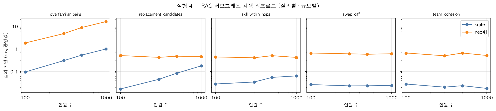
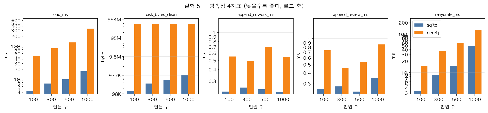

# TeamWeaver 최적화 실험 리포트

> 이 파일은 `experiments/report.py`가 `experiments/results/*.json`에서 생성한다. **직접 수정하지 말 것** — 실험을 다시 돌린 뒤 `uv run python -m experiments.report`로 갱신하면 동일 입력에 대해 **재현 가능**한 동일 결과가 나온다.

## 측정 방법론

- 실험 1은 반복 20회, 백엔드별 웜업은 memory 웜업 3회, neo4j 웜업 50회, sqlite 웜업 3회 (neo4j는 드라이버/서버 예열을 위해 더 큰 웜업을 쓴다), **중앙값과 p95**를 보고한다
- 실험 3(알고리즘)은 solver 특성상 반복 없이 1회 solve 시간을 그대로 보고한다
- 데이터 생성 시드 고정(seed=42) — `fixtures/meta.json`과 실험 3 결과가 같은 시드를 기록해 세 실험 공통임을 교차 확인했다. 동일 시드로 재실행하면 동일 데이터가 생성된다
- 실험 코드는 제품 코어(`core/`)를 그대로 import한다. **벤치마크 수치 = 실제 제품 성능**
- 결과가 가설과 다르면 결과를 조작하지 않고 논지를 결과에 맞춰 서술한다

**실행 환경:** Python 3.12.13 · macOS-26.5.2-arm64-arm-64bit · CPU 10코어(Apple M4) · RAM 16.0 GiB · Neo4j 서버 Neo4j Kernel 5.26.28 (community)

---

## 실험 1 — 저장·탐색 계층 3자 비교

**질문:** 인력 집합의 N-hop 협업 문맥을 수집·집계할 때 어느 저장 방식이 빠른가?

**측정 범위(50~1000명, hops 1~4) 전 구간에서 memory < sqlite < neo4j 순서가 유지된다 — "규모·hops가 커지면 Neo4j가 역전한다"는 이 실험의 원 가설은 기각된다.**

| 인원 | hops | sqlite | neo4j | memory | 결과수 |
|---:|---:|---:|---:|---:|---:|
| 50 | 1 | 0.043 | 1.504 | 0.039 | 17 |
| 50 | 2 | 0.105 | 1.183 | 0.054 | 66 |
| 50 | 3 | 0.281 | 2.182 | 0.074 | 157 |
| 50 | 4 | 0.597 | 3.787 | 0.093 | 221 |
| 100 | 1 | 0.058 | 0.808 | 0.036 | 19 |
| 100 | 2 | 0.141 | 1.421 | 0.059 | 83 |
| 100 | 3 | 0.398 | 2.863 | 0.084 | 239 |
| 100 | 4 | 0.971 | 4.737 | 0.110 | 414 |
| 200 | 1 | 0.088 | 0.689 | 0.040 | 17 |
| 200 | 2 | 0.177 | 1.849 | 0.062 | 91 |
| 200 | 3 | 0.535 | 3.756 | 0.095 | 333 |
| 200 | 4 | 1.544 | 8.718 | 0.142 | 744 |
| 300 | 1 | 0.218 | 0.695 | 0.096 | 26 |
| 300 | 2 | 0.255 | 1.708 | 0.071 | 130 |
| 300 | 3 | 0.774 | 5.206 | 0.114 | 459 |
| 300 | 4 | 2.254 | 12.091 | 0.174 | 1038 |
| 500 | 1 | 0.172 | 0.570 | 0.048 | 16 |
| 500 | 2 | 0.269 | 1.461 | 0.077 | 94 |
| 500 | 3 | 0.633 | 3.895 | 0.118 | 330 |
| 500 | 4 | 1.963 | 10.962 | 0.191 | 990 |
| 1000 | 1 | 0.350 | 0.644 | 0.064 | 25 |
| 1000 | 2 | 0.468 | 1.688 | 0.103 | 113 |
| 1000 | 3 | 0.986 | 5.537 | 0.162 | 457 |
| 1000 | 4 | 2.978 | 16.992 | 0.268 | 1532 |

*단위: ms, 반복 20회 중앙값. 연결 수립·적재 시간 제외.*

> ✅ 백엔드 결과 일치 24건 전부 확인 — 세 방식이 같은 도달 집합을 반환한다.

**프로토콜 바닥값(protocol_floor):** 중앙값 0.6058ms / p95 1.0627ms — 실제 그래프 순회 없이 요청·응답만 왕복하는 최소 IPC 비용의 실측치다.

**p95 요약 (hop별, 인원 50~1000명 범위의 최소~최대):**

| hops | sqlite p95(ms) | neo4j p95(ms) | memory p95(ms) |
|---:|---:|---:|---:|
| 1 | 0.044~0.359 | 0.644~3.828 | 0.042~0.135 |
| 2 | 0.108~0.481 | 1.431~2.983 | 0.059~0.114 |
| 3 | 0.288~1.031 | 2.689~7.665 | 0.078~0.167 |
| 4 | 0.626~3.000 | 5.867~17.647 | 0.095~0.273 |

> 인원 수가 늘어난다고 순회 결과 수(result_count)가 항상 함께 늘지는 않는다 — hops=1: n=100→200에서 결과수 19→17; hops=1: n=300→500에서 결과수 26→16; hops=2: n=300→500에서 결과수 130→94; hops=3: n=300→500에서 결과수 459→330; hops=4: n=300→500에서 결과수 1038→990. 인원 수를 작업량의 단조 대리지표로 쓰지 말 것(결과 수가 적으면 순회할 것도 적어 그만큼 더 빠르다).

### 스코프 명시 (반드시 함께 읽을 것)

1. **hops=1 비교는 순회가 아니라 IPC가 지배한다.** hops=1 neo4j 시간은 순수 왕복 비용(protocol_floor, 중앙값 0.606ms)과 측정 오차 안에서 구별되지 않는다 — 바닥값이 쿼리 시간의 40~106%에 해당해 일부 구간에서는 바닥값이 쿼리 시간을 넘어서기까지 한다. 즉 이 구간에서 잰 것은 그래프 순회 비용이 아니라 프로토콜 왕복 비용이므로, 얕은 hop만 보고 백엔드를 비교하면 오해를 부른다.
2. **인메모리 백엔드의 승리는 거의 동어반복적(near-tautological)이다.** 이 측정은 빌드/적재 비용을 제외했고, 인메모리 구조는 이미 전량 RAM에 상주하며 이번 워크로드는 어차피 RAM에 다 들어간다 — "발견"이 아니라 설계상 당연한 결과다.
3. **이 실험은 제안된 하이브리드("Neo4j 저장·탐색 + 인메모리 연산")가 아니라 세 개의 독립 대안을 각각 측정한 것이다.** 하이브리드의 실제 가치(영속성, 임의 탐색, Graph RAG 서브그래프 검색)는 이 벤치마크가 다루지 않는다.
4. **측정 구간 자체가 백엔드 간 비대칭이다.** 인메모리 방식은 `node_polarity`를 그래프 빌드 시점에 미리 계산해 두고(빌드는 측정 밖) 순회 시점에는 조회만 한다(`core/graph/memory_graph.py:56-58`). 반면 SQLite는 매 호출마다 `node_polarity` CTE를 다시 계산하고, Neo4j는 매 호출마다 `avg(v.polarity)`를 다시 집계한다 — 즉 측정된 인메모리 시간에는 이 집계 비용이 아예 들어있지 않다. 스코프 노트 2(적재 비용 제외)와는 별개의 비대칭이다.

> neo4j/sqlite 배율은 hops=4 기준 4.88~6.34배 범위에서 평평하다 — 규모가 커진다고 격차가 좁혀지는 추세는 관측되지 않았다.

---

## 실험 2 — 파이프라인 비용 (Full-LLM vs Hybrid)

**모델:** `gpt-5-nano` · **단가 기준일:** 2026-08-05 · **리뷰 266건**

| 방식 | 입력 토큰 | 추정 비용(USD) |
|---|---:|---:|
| Full-LLM (정형+항목+서술 전부) | 87,896 | 0.2075 |
| Hybrid (자유서술만) | 60,292 | 0.1423 |

**측정된 절감률: 31.4%**

> 이 절감률은 대수적으로 입력 토큰 비율(1 − hybrid/full)과 같다 — 출력 토큰 가정(out_ratio)이 두 arm에 같은 배수로 적용되는 한 그 배수는 cost 비율에서 상쇄되어 결과에 전혀 영향을 주지 않는다(`tests/test_exp2.py::test_savings_pct_is_independent_of_out_ratio`가 회귀 테스트로 고정). 즉 아래 달러 금액은 출력 토큰 가정에 따라 크게 바뀌지만, 이 절감률 자체는 그 가정과 무관하다 — 달러는 노출을 더할 뿐 절감률에 대한 추가 정보를 주지 않는다.

> 절감률은 목표치가 아니라 **측정 결과**다. 우리 fixture의 정형:비정형 비중이 이 값을 결정하므로 아래 민감도 곡선을 함께 본다.

> 프로젝트 초기 설계 문서는 이보다 **훨씬 높은** 절감률을 목표로 제시했다 — 위 측정치는 그 목표에 크게 못 미친다. 최초 목표 수치 자체는 `experiments/results/*.json` 범위 밖의 로컬 설계 문서에만 있어 이 리포트에는 싣지 않는다(원 목표는 `.omc/plan/2026-08-02-teamweaver-poc-design.md` 참조 — 이 경로는 `.gitignore`의 `.omc/` 규칙 대상이라 이 저장소를 클론한 사람은 파일을 열어볼 수 없다; 그래서 정확한 수치를 싣는 대신 존재와 위치만 밝힌다).

*출력 토큰/입력 토큰 비율 가정: 5.777 — 근거: Task 6 체크포인트 실측 gpt-5-nano(parse_model) completion/prompt = 429,783/74,390 (266건 전량, experiments/results/llm_checkpoint_summary.json — hybrid-shaped parse 워크로드에서 측정, Full-LLM 페이로드로의 적용은 다른 형태 간 외삽임)*

**출력 토큰 모델 민감도** — savings_pct가 출력 토큰을 어떻게 가정하느냐에 얼마나 의존하는지 정반대 가정 두 가지로 계산했다:

| 출력 토큰 가정 | 절감률(%) |
|---|---:|
| 출력 ∝ 입력 (이 실험이 채택) | 31.41 |
| 출력 두 arm 동일(실측 completion 토큰 고정) | 0.78 |

> 출력 토큰 가정을 '입력에 비례'에서 '두 arm 동일'로 바꾸면 절감률은 31.4%→0.8%로 바뀐다 — 이 실험이 실제로 채택한 가정(출력 ∝ 입력)이 헤드라인 절감률을 얼마나 떠받치고 있는지를 보여준다. 게다가 5.777이라는 비율 자체는 이 실험의 페이로드가 아니라 hybrid-shaped parse 워크로드(자유서술만 담은 기존 파싱 프롬프트)에서 측정된 것이므로, 위 표의 '이 실험이 채택' 행은 서로 다른 페이로드 형태 간 외삽에 기댄 결과라는 점을 함께 읽을 것 — 특히 그 비율이 큰 이유 자체가 추론 모델의 내부 추론 토큰(과제 난이도에 비례, 프롬프트 길이에 비례하지 않음)이라서 고정 출력 스키마를 갖는 이 추출 과제에 '출력 ∝ 입력' 가정을 적용하는 것은 특히 취약하다.

| 자유서술 분량 배수 | 절감률(%) |
|---:|---:|
| 0.25× | 54.9 |
| 0.5× | 43.9 |
| 1.0× | 31.4 |
| 2.0× | 20.0 |
| 4.0× | 11.6 |

> 자유서술 분량이 0.25×~4.0×일 때 절감률은 54.9%→11.6%로 단조 감소한다 — 절감률은 고정 상수가 아니라 정형/비정형 리뷰 내용 비중에 강하게 의존하는 값이다.

**정확도 검증:** live=False 이므로 미측정

**지연(latency) 검증:** 미측정 — 이번 실험은 라이브 타이밍 호출을 하지 않았다(비용 절감을 위해 오프라인 토큰 카운팅만 수행). 아래는 Task 6에서 실측된 파싱 워크로드 지연을 참고치로 인용한 것이며, 이번 실험의 Full-LLM/Hybrid 페이로드 형태로 직접 측정된 값이 아니다.

> 참고치 근거: Task 6 체크포인트 실행(gpt-5-mini gen + gpt-5-nano parse, 266건 리뷰 = 532회 API 호출): 리뷰당(gen+parse 2회 합산) 관측 지연 ~24-28초, foreground 배치 실행 1회당 5.1-8.5분(회당 3~18건, 20회 실행). 개별 API 호출 단위로는 ~10-28초로 추정(추론 모델 특성상 completion에 내부 추론 토큰이 실려 지연이 커짐 — MEASURED_OUT_RATIO가 큰 것과 동일한 원인).

> 주의: 이 지연은 parse_reviews_llm의 기존 프롬프트(좋은점/나쁜점 서술만 전달)로 측정된 것이다. 이번 실험의 Full-LLM 페이로드는 정형 이력+항목선택+서술 전부를 담아 입력 토큰이 더 크므로 지연이 이보다 클 것으로 추정되나 직접 측정되지 않았다 — Full-LLM 페이로드 형태의 실측이 아니라 parse 워크로드 실측을 그대로 인용한 하한(lower-bound) 성격의 참고치다.

> 출처: `experiments/results/llm_checkpoint_summary.json`

> 이 비교의 전제는 fixture가 실제 LLM 호출로 생성된 리뷰(266건, `review_mode=llm`, 생성 모델 `gpt-5-mini`, 파싱 모델 `gpt-5-nano`(`fixtures/meta.json` 기록))라는 것이다 — 템플릿 생성 리뷰였다면 자유서술의 극성(polarity)이 정형 `item_score`의 결정론적 함수였으므로 비정형 항목이 별도 정보를 담지 않아, 정형 대 비정형을 비교하는 이 실험의 전제 자체가 성립하지 않았다. (정확한 재동결 비용은 results/*.json 범위 밖이라 이 리포트에는 싣지 않는다 — Task 6 작업 기록 참조.)

---

## 실험 3 — 알고리즘 (Greedy vs MILP)

> **데이터 출처:** 이 스윕의 모든 행은 datasets.build_scale()이 규모마다 새로 생성한 데이터셋을 쓴다 (core.datagen.generator, seed=42 고정, rule-based 파싱의 템플릿 리뷰) — 커밋된 LLM 모드 데모 fixture(fixtures/*.json)를 로드하지 않는다. n=100 지점도 인원·프로젝트 수만 fixture와 같을 뿐 리뷰 텍스트가 달라 C 행렬과 optimization_ratio가 fixture와 다르다 — 프로젝트 개수/인원 수가 같다고 같은 데이터가 아니다.

| 알고리즘 | 인원 | pair_cap | solve(ms) | 최적화율 | 미충원 |
|---|---:|---:|---:|---:|---:|
| greedy | 50 | — | 0.2 | 0.722 | 1 |
| milp | 50 | 1000 | 751.4 | 0.917 | 0 |
| milp | 50 | 5000 | 705.7 | 0.917 | 0 |
| greedy | 100 | — | 0.7 | 0.707 | 0 |
| milp | 100 | 1000 | 7090.2 | 0.928 | 0 |
| milp | 100 | 5000 | 6994.3 | 0.928 | 0 |
| greedy | 200 | — | 2.4 | 0.673 | 3 |
| milp | 200 | 1000 | 23321.1 | 0.885 | 0 |
| milp | 200 | 5000 | 44700.1 | 0.883 | 0 |

### 제약 준수 — 이 실험의 핵심

| 알고리즘 | 인원 | pair_cap | 예산 위반 프로젝트 수 |
|---|---:|---:|---:|
| greedy | 50 | — | 0 |
| milp | 50 | 1000 | 0 |
| milp | 50 | 5000 | 0 |
| greedy | 100 | — | 1 |
| milp | 100 | 1000 | 0 |
| milp | 100 | 5000 | 0 |
| greedy | 200 | — | 2 |
| milp | 200 | 1000 | 0 |
| milp | 200 | 5000 | 0 |

> Greedy는 점수만 보고 담아 예산을 넘긴 해를 내놓는다. MILP는 예산을 지키는 대신 부족분을 미충원으로 **정직하게 드러낸다** — 실행 가능한 해와 그렇지 않은 해의 차이다.

> Greedy는 구조적으로 예산 로직이 없다 — 각 프로젝트에 필요한 인력을 점수순으로 다 배정한 *뒤에야* 그 프로젝트의 누적 비용을 예산과 비교해 위반 여부만 *기록*할 뿐, 그 결과로 어떤 후보도 거부하거나 배정을 되돌리지 않는다(`core/optimize/greedy.py`, `for j, proj in ...` 루프 안에서 해당 프로젝트의 배정이 끝난 뒤 `if cost > proj.monthly_budget`을 확인). 따라서 아래 "MILP 0건 vs Greedy 0→1→2건"은 예산 제약을 아예 갖지 않는 베이스라인이 치르는 구조적 대가를 재는 것이지, **저비용의 제약-인지 휴리스틱이 존재하지 않는다는 근거가 아니다.**

> MILP는 측정된 모든 규모(50, 100, 200명)·모든 pair_cap(1000, 5000)에서 예산 위반 0건이다.

> Greedy의 예산 위반(원시 건수/프로젝트 수 대비 비율): n=50: 0/10건(0%), n=100: 1/20건(5%), n=200: 2/40건(5%).

> MILP(pair_cap=1000)의 optimization_ratio는 n=50: 0.9169, n=100: 0.9278, n=200: 0.8855이다.
> **n=200에서 90% 목표선 아래로 떨어진다** — "목표 90%"는 이 스윕이 기준으로 삼은 n=100(seed=42로 새로 생성한 데이터셋 — 커밋된 데모 fixture가 아니다)에서만 성립하고, 규모가 커지면 유지된다는 보장이 없다.
> 참고로 커밋된 데모 fixture(LLM 모드 리뷰, `README.md`의 E2E 스모크 기록 참고)는 n=100에서 optimization_ratio=0.9300를 낸다 — 이 스윕의 n=100 값(0.9278)과는 다른 수치다. 인원·프로젝트 수는 fixture와 같지만 리뷰 텍스트가 다르게 생성되어 C 행렬(시너지)이 달라지기 때문이다 — 두 수치를 같은 것으로 섞어 인용하지 말 것.

> **optimization_ratio가 재는 것:** 분자·분모 모두 스킬 항(Σ S_ij·a_ij)만 쓴다(`core/optimize/metrics.py::optimization_ratio`) — 하지만 배치 자체는 `solve_milp`가 스킬 + λ·시너지 − μ·클리크 패널티 − slack 패널티라는 다중 항 목적함수를 최대화해 고른 것이다. 즉 이 비율은 그 다중 항 목적함수 중 스킬 항 하나만 측정한다. 실제 solve 파라미터: λ=0.3, μ=0.2, gap=0.05, time_limit=180s, pair_keep_ratio=0.15, min_alloc=0.2, slack_penalty=100.0(max_pairs는 cap별로 다름, 위 표 참고).

### pair_cap 절삭 수준 비교

| 인원 | 최적화율(cap=1000) | 최적화율(cap=5000) | solve(ms, cap=1000) | solve(ms, cap=5000) | 시간 배율 |
|---:|---:|---:|---:|---:|---:|
| 50 | 0.9169 | 0.9169 | 751.4 | 705.7 | 0.94× |
| 100 | 0.9278 | 0.9278 | 7090.2 | 6994.3 | 0.99× |
| 200 | 0.8855 | 0.8829 | 23321.1 | 44700.1 | 1.92× |

> 최적화율 차이는 최대 0.0026으로 사실상 잡음 수준이다. 반면 시간 배율은 0.94×~1.92× 범위다 — cap을 올리는 것이 품질 이득 없이 시간만 태우는 규모가 있다.

### 대안(Plan B/C/D) 품질

| 인원 | 대안 수 | 라벨 | Plan A 대비 품질 | Plan A와 Jaccard |
|---:|---:|---|---|---|
| 50 | 3 | A/B/C/D | 0.998, 0.997, 0.996 | 0.646, 0.646, 0.683 |
| 100 | 3 | A/B/C/D | 0.995, 0.990, 0.987 | 0.689, 0.695, 0.674 |
| 200 | 3 | A/B/C/D | 0.997, 0.992, 0.996 | 0.686, 0.701, 0.669 |

> 이 표의 Plan A는 gap=0.01로, 대안(B/C/D)은 gap=0.05로 solve된다(둘 다 max_pairs=5000 고정 — `core/optimize/alternatives.py::generate_plans`) — 위쪽의 "pair_cap 절삭 수준 비교" 표(gap=0.05, cap∈{1000, 5000})와는 gap·cap 조합이 달라 직접 비교할 수 없다. Plan A 자체도 그 표의 어느 행과도 같은 조건으로 solve된 것이 아니다.

### 미측정 규모 (n≥300)

| 인원 | 프로젝트 | 상태 | 사유 |
|---:|---:|---|---|
| 300 | 60 | skipped | extrapolated beyond practical session budget: milp cap=1000 solve_ms 766.7 -> 6933.5 -> 22628.7 at n=50/100/200 (9.04x, then 3.26x per doubling); n=300 was attempted twice and killed (CBC healthy, not hung, but not converging inside budget) before this skip list was added |
| 500 | 100 | skipped | extrapolated beyond practical session budget: milp cap=1000 solve_ms 766.7 -> 6933.5 -> 22628.7 at n=50/100/200 (9.04x, then 3.26x per doubling); n=300 was attempted twice and killed (CBC healthy, not hung, but not converging inside budget) before this skip list was added |
| 1000 | 200 | skipped | extrapolated beyond practical session budget: milp cap=1000 solve_ms 766.7 -> 6933.5 -> 22628.7 at n=50/100/200 (9.04x, then 3.26x per doubling); n=300 was attempted twice and killed (CBC healthy, not hung, but not converging inside budget) before this skip list was added |

> 위 규모는 **미측정(skipped)** 이다 — 아래 표의 solve time·optimization_ratio 수치는 이 규모들을 다루지 않는다. 인용 시 "n≥300은 외삽 근거로 제외했다"는 사실을 함께 밝힐 것.

---

## 실험 4 — RAG 서브그래프 검색 워크로드 (SQLite vs Neo4j)

**질문:** XAI 브리핑이 실제로 필요로 하는 5가지 형태의 문맥 검색에서 어느 저장 방식이 빠른가? 실험 1이 잰 것은 정해진 질의 하나였고, 여기서는 "임의 형태의 서브그래프 검색"이라는 Neo4j 본래 용도를 잰다.

**헤드라인 — 의사결정 규칙 1이 소비하는 수치: 20개 셀 중 Neo4j가 더 빠른 셀 0개.** (사전 고정 임계: 과반 11개 이상이면 성능 근거로 존치)

| 질의 | 인원 | sqlite | neo4j | neo4j/sqlite | 결과수 |
|---|---:|---:|---:|---:|---:|
| `overfamiliar_pairs` | 100 | 0.0946 | 1.8102 | 19.1× | 137 |
| `overfamiliar_pairs` | 300 | 0.2998 | 4.6983 | 15.7× | 434 |
| `overfamiliar_pairs` | 500 | 0.5248 | 8.7350 | 16.6× | 747 |
| `overfamiliar_pairs` | 1000 | 0.9812 | 15.9463 | 16.3× | 1390 |
| `replacement_candidates` | 100 | 0.0167 | 0.5030 | 30.1× | 3 |
| `replacement_candidates` | 300 | 0.0449 | 0.4198 | 9.3× | 2 |
| `replacement_candidates` | 500 | 0.0835 | 0.4719 | 5.7× | 4 |
| `replacement_candidates` | 1000 | 0.1759 | 0.4571 | 2.6× | 6 |
| `skill_within_hops` | 100 | 0.0278 | 0.4371 | 15.7× | 3 |
| `skill_within_hops` | 300 | 0.0340 | 0.4023 | 11.8× | 5 |
| `skill_within_hops` | 500 | 0.0544 | 0.4968 | 9.1× | 6 |
| `skill_within_hops` | 1000 | 0.0635 | 0.4170 | 6.6× | 5 |
| `swap_diff` | 100 | 0.0262 | 0.6531 | 24.9× | 25 |
| `swap_diff` | 300 | 0.0230 | 0.6006 | 26.1× | 21 |
| `swap_diff` | 500 | 0.0231 | 0.5741 | 24.8× | 20 |
| `swap_diff` | 1000 | 0.0239 | 0.6043 | 25.3× | 22 |
| `team_cohesion` | 100 | 0.0277 | 0.6539 | 23.6× | 10 |
| `team_cohesion` | 300 | 0.0201 | 0.4914 | 24.4× | 4 |
| `team_cohesion` | 500 | 0.0234 | 0.6509 | 27.8× | 4 |
| `team_cohesion` | 1000 | 0.0177 | 0.5078 | 28.7× | 2 |

*단위: ms, 중앙값 (neo4j 반복 20회·웜업 50회, sqlite 반복 20회·웜업 3회). 적재는 양쪽 다 측정 밖.*

> ✅ 백엔드 결과 일치 20건 전부 확인 — 두 구현이 같은 행 집합을 반환한다(부동소수 표기 차만 정규화). 아래 지연 차이는 결과 크기 차이가 아니라 백엔드 자체의 특성이다.

> **표본 겹침 없음: 20/20개 셀에서 Neo4j 최솟값이 SQLite 최댓값보다 크다.** 가장 근접한 셀조차 `replacement_candidates @ n=1000`에서 2.4배 차이다 — 중앙값 대신 어떤 추정량을 써도 승패가 뒤집히지 않는다.

### 캘리브레이션 — 반드시 **구간**으로 읽을 것

Neo4j 쪽에만 붙고 SQLite 쪽에는 없는 호출당 고정비다(`neo4j_rag._run`은 호출마다 세션을 연다. SQLite는 벤치마크가 이미 열어 둔 `conn`을 받는다). **원 수치에서 빼지 않는다** — 사전 고정 규칙은 원값으로 판정한다.

| 항목 | 중앙값(ms) | p95(ms) | Neo4j 중앙값 대비 |
|---|---:|---:|---|
| 세션 획득/반납만 | 0.0045 | 0.0048 | 0.03~1.1% |
| 세션 + `RETURN 1` (고정 바닥 전체) | 0.3174 | 0.3440 | 1.99~78.9% |
| (대칭) SQLite `SELECT 1` | 0.0005 | 0.0006 | — |

> 세션 획득만 보면 Neo4j 중앙값의 극히 일부지만, 커넥션 획득과 왕복까지 포함한 **고정 바닥 전체**는 출력이 고정에 가까운 질의 4종의 중앙값 중 49~79%를 차지한다. **제거 가능한 성분(풀 체크아웃 상환분)은 분리 측정되지 않았다** — 낮은 쪽 끝만 인용하면 고정비를 과소 보고하는 것이고, 높은 쪽 끝만 인용하면 실제로 뺄 수 있는 양을 과대 보고하는 것이다. 두 끝을 함께 읽을 것.

**민감도(규칙 1이 이 고정비에 얼마나 민감한가):**

- 세션 획득분을 Neo4j 수치에서 빼면 뒤집히는 셀 **0/20**
- 고정 바닥 전체를 빼면(= 실제로 뺄 수 있는 양보다 과보정) 뒤집히는 셀 **1/20**

> 즉 규칙 1(과반 11개)은 이 고정비를 어떻게 처리하든 결론이 바뀌지 않는다 — 과보정을 해도 임계 근처에도 가지 않는다. 이 비대칭은 증명 가능하게 판정과 무관하다.

### 한계 (반드시 함께 읽을 것)

1. **폐기된 첫 스윕이 있다.** 커밋된 JSON은 두 번의 스윕 중 두 번째다. 첫 실행은 다섯 질의 전부가 n=300에서 봉우리를 만든 뒤 회복했고, 재현되지 않았다 — 중간 지점의 봉우리는 워밍업 교락의 형태(n=100부터 단조 감소)가 아니다. 첫 실행의 집계도 Neo4j 0/20이었다. **다만 첫 실행의 원자료는 보존되지 않았고 복구할 수 없다** (`harness.save_result`가 고정 경로를 덮어쓴다). 그래서 "첫 실행이 Neo4j에 더 불리했다"처럼 확인할 수 없는 주장은 하지 않는다 — 셀 단위로는 성립하지도 않았다.
2. **배포 토폴로지가 대칭이 아니다.** Neo4j는 컨테이너(`neo4j:5-community`, `bolt://localhost:7687`, 힙·페이지캐시 튜닝 없음)에서 돌고, Apple Silicon에서는 host↔Linux VM 경계까지 통과한다. SQLite는 in-process 네이티브 라이브러리다. 위 3~30배 격차를 이것만으로 뒤집을 수는 없지만, 이를 "네트워크 왕복" 한마디로 적으면 축소 서술이다.
3. **n=1000을 넘어 외삽하지 말 것.** 출력이 규모에 따라 실제로 커지는 질의는 `overfamiliar_pairs`(137→1390행) 뿐이고, 나머지(`replacement_candidates`(3→6행), `skill_within_hops`(3→5행), `swap_diff`(25→22행), `team_cohesion`(10→2행))는 사실상 고정 출력이다. 즉 20개 셀 중 16개는 그래프 규모가 아니라 **호출당 고정비 + 앵커된 인덱스 조회**를 재고 있다. 일부 질의에서 관측되는 격차 축소를 규모에 대한 추세 주장으로 옮기지 말 것.
4. **p95는 약한 추정량이다.** 반복 20회에서 p95는 정렬된 표본 중 위에서 두 번째 값에 해당한다. 양쪽에 동일하게 적용되고 이 정도 격차는 어떤 추정량에서도 유지되지만(위 표본 겹침 검사), 백분위수의 통상적 의미로 읽지 말 것.

---

## 실험 5 — 영속성 (SQLite vs Neo4j)

**질문:** 인메모리 계층에는 영속성이 없다 — 재시작하면 저장소에서 전량 다시 읽어야 한다. 그렇다면 저장소의 가치는 탐색 속도가 아니라 (1) 적재 (2) 공간 (3) 증분 갱신 (4) 재수화에서 나온다. 실험 1·4가 재지 않은 축이다.

**헤드라인 — 의사결정 규칙 2가 소비하는 수치: 4지표 중 Neo4j 우위 0개.** (사전 고정 임계: 3개 이상이면 영속성 근거로 존치)

> **판정 대상 스윕:** `experiments/results/exp5_persistence_primed.json` (light path까지 예열한 재측정). 첫 스윕도 `experiments/results/exp5_persistence.json`으로 **함께 커밋돼 있다** — Task 4에서 재실행이 첫 스윕을 통째로 덮어써 원자료를 잃은 전례가 있어 이번에는 두 실행을 모두 보존했다.

| 지표 | 인원 | sqlite | neo4j | neo4j/sqlite |
|---|---:|---:|---:|---:|
| `load_ms` | 100 | 4.407 | 51.150 | 11.6× |
| `load_ms` | 300 | 7.366 | 86.497 | 11.7× |
| `load_ms` | 500 | 9.830 | 129.403 | 13.2× |
| `load_ms` | 1000 | 17.394 | 338.699 | 19.5× |
| `disk_bytes_clean` | 100 | 147,456 | 541,458,599 | 3,672.0× |
| `disk_bytes_clean` | 300 | 356,352 | 541,925,543 | 1,520.8× |
| `disk_bytes_clean` | 500 | 557,056 | 542,433,447 | 973.8× |
| `disk_bytes_clean` | 1000 | 1,048,576 | 543,662,247 | 518.5× |
| `append_cowork_ms` | 100 | 0.231 | 0.550 | 2.4× |
| `append_cowork_ms` | 300 | 0.255 | 0.489 | 1.9× |
| `append_cowork_ms` | 500 | 0.244 | 0.702 | 2.9× |
| `append_cowork_ms` | 1000 | 0.230 | 0.545 | 2.4× |
| `append_review_ms` | 100 | 0.260 | 0.735 | 2.8× |
| `append_review_ms` | 300 | 0.277 | 0.455 | 1.6× |
| `append_review_ms` | 500 | 0.241 | 0.538 | 2.2× |
| `append_review_ms` | 1000 | 0.344 | 0.860 | 2.5× |
| `rehydrate_ms` | 100 | 3.352 | 15.163 | 4.5× |
| `rehydrate_ms` | 300 | 8.711 | 36.783 | 4.2× |
| `rehydrate_ms` | 500 | 15.145 | 58.591 | 3.9× |
| `rehydrate_ms` | 1000 | 49.294 | 126.497 | 2.6× |

*단위: ms 또는 bytes. 적재·재수화는 반복 3회, 증분 갱신은 반복 20회(둘 다 양쪽 백엔드 동일).*

**규칙 2 집계 — 지표별 규모 셀의 과반으로 판정** (disk 판독: `disk_bytes_clean`)

| 지표 | 센 항목 | 셀 | Neo4j 우위 셀 | 지표 판정 |
|---|---|---:|---:|---|
| `load_ms` | `load_ms` | 4 | 0 | 열세 |
| `disk_bytes` | `disk_bytes_clean` | 4 | 0 | 열세 |
| `append_*_ms` | `append_cowork_ms`, `append_review_ms` | 8 | 0 | 열세 |
| `rehydrate_ms` | `rehydrate_ms` | 4 | 0 | 열세 |

→ Neo4j 우위 지표 **0 / 4** (사전 고정 임계 3 이상이면 존치)

> 집계 방식(지표당 규모 셀의 과반)은 사전 고정 규칙에 명시돼 있지 않아 실험 5에서 정하고 여기에 밝힌다. `experiments/decision.py`와 실험 5 러너가 이 집계를 **독립적으로 두 번** 계산하며, `tests/test_decision.py::test_rule2_reproduces_the_tally_persisted_by_task6`이 커밋된 JSON에 저장된 집계와 지표별로 일치함을 고정한다.

**두 스윕의 집계 — 둘 다 같은 답을 낸다.**

**첫 스윕 (`exp5_persistence.json`)** (disk 판독: `disk_bytes_clean`)

| 지표 | 센 항목 | 셀 | Neo4j 우위 셀 | 지표 판정 |
|---|---|---:|---:|---|
| `load_ms` | `load_ms` | 4 | 0 | 열세 |
| `disk_bytes` | `disk_bytes_clean` | 4 | 0 | 열세 |
| `append_*_ms` | `append_cowork_ms`, `append_review_ms` | 8 | 0 | 열세 |
| `rehydrate_ms` | `rehydrate_ms` | 4 | 0 | 열세 |

→ Neo4j 우위 지표 **0 / 4** (사전 고정 임계 3 이상이면 존치)

> ⚠️ **두 스윕의 절대값을 서로 빼서 비교하지 말 것** — Neo4j `append_*`의 실행 간 분산이 크다. 판정은 **한 스윕 내부**에서 한다. 두 실행이 지표별로 같은 결론에 도달했다는 사실만 인용할 것.

**`disk_bytes`는 어느 판독으로 판정했는가 — 명시한다.**

- **판정 기준: `disk_bytes_clean`** — 볼륨 삭제 → 재기동 → 해당 규모 하나만 적재 → 체크포인트를 흘려보내기 위해 컨테이너 정지 후 측정.
- 누적 판독(`disk_bytes`)은 이전 규모의 잔여를 포함해 단조 증가하므로 규모별 비교에 쓸 수 없다. **그렇다고 지표를 "비교 불가"로 빼지는 않았다** — 뺐다면 규칙 2가 몰래 "3 of 3"이 되어 사전 고정 규칙을 사후 변경하는 셈이 된다.

- 클린 판독 총량 중 **540,147,712 B는 네 규모에서 값이 완전히 같다** (데이터베이스당 트랜잭션 로그 선할당 + system 데이터베이스). 즉 이 부분은 데이터 크기와 무관한 **고정 선불**이고, 그래서 가장 작은 규모의 Neo4j조차 가장 큰 규모의 SQLite를 압도한다.

**대안 판독 — Neo4j에 가장 유리한 읽기(스토어 파일만, 트랜잭션 로그·system 제외):**

| 인원 | sqlite store(B) | neo4j store(B) | 배율 |
|---:|---:|---:|---:|
| 100 | 147,456 | 1,310,720 | 8.9× |
| 300 | 356,352 | 1,777,664 | 5.0× |
| 500 | 557,056 | 2,285,568 | 4.1× |
| 1000 | 1,048,576 | 3,514,368 | 3.4× |

> 트랜잭션 로그와 system 데이터베이스를 전부 빼 준 이 판독에서도 Neo4j는 3.4~8.9배 크다 — 규칙 2의 disk 지표는 어느 판독으로 읽어도 뒤집히지 않는다.

### 캘리브레이션 — 공개용이며 헤드라인에서 차감하지 않는다

| 인원 | DETACH DELETE(ms) | = neo4j `load_ms`의 | SQLite `unlink`(ms) | = sqlite `load_ms`의 | `_assemble`(ms) | = sqlite/neo4j `rehydrate_ms`의 | 두 엔드포인트 MATCH(ms) | = neo4j `append_cowork_ms`의 |
|---:|---:|---:|---:|---:|---:|---:|---:|---:|
| 100 | 4.679 | 9.1% | 0.023 | 0.53% | 0.703 | 21.0% / 4.6% | 0.519 | 94% |
| 300 | 15.573 | 18.0% | 0.024 | 0.33% | 2.223 | 25.5% / 6.0% | 0.402 | 82% |
| 500 | 24.058 | 18.6% | 0.042 | 0.43% | 3.766 | 24.9% / 6.4% | 0.578 | 82% |
| 1000 | 54.009 | 15.9% | 0.051 | 0.29% | 7.650 | 15.5% / 6.0% | 0.498 | 91% |

관측되는 사실 네 가지:

1. **철거 비대칭은 실재하지만 격차를 설명하지 못한다.** `load_neo4j`의 타이밍 구간에는 `MATCH (n) DETACH DELETE n`(O(n))이 들어 있고 `build_sqlite`에는 `path.unlink()`(O(1))만 들어 있다. 양쪽에서 각각 빼면:

| 인원 | 철거분 차감 후 sqlite(ms) | 차감 후 neo4j(ms) | 배율 |
|---:|---:|---:|---:|
| 100 | 4.384 | 46.471 | 10.6× |
| 300 | 7.342 | 70.924 | 9.7× |
| 500 | 9.787 | 105.345 | 10.8× |
| 1000 | 17.343 | 284.690 | 16.4× |

   → 차감 후에도 9.7~16.4배 열세다.

2. **공유 파이썬 비용(`_assemble`)을 빼면 Neo4j가 *더* 나빠진다.** 두 백엔드가 똑같이 내는 `MemoryGraph.build` 비용은 SQLite `rehydrate_ms`에서 더 큰 몫을 차지한다. 빼면 배율이 2.6~4.5× → 2.9~5.5×로 **올라간다** — 이 항목의 할인은 Neo4j에 유리하지 않다.

3. **`append_*`의 엔드포인트 `MATCH`는 차감하지 않는다 — 그러나 반사실은 명시한다.** Neo4j의 `append_*`는 두 `Person`을 id로 `MATCH`한 뒤 관계를 `MERGE`하고, SQLite의 `collaboration`에는 외래키가 없어 INSERT가 읽기를 0회 한다. 이것은 "엔진 외 오버헤드"가 아니라 **엔진·스키마의 진짜 비용**이므로 빼지 않는다. 그래도 빼 보면 8개 셀 중 **7개**에서 Neo4j 잔차가 SQLite보다 작아져 `append_*` 지표가 통째로 뒤집힌다(cowork 4, review 3). 그러면 규칙 2는 **1 of 4**가 되지만 임계 3에는 **여전히 미달이라 판정은 유지된다**.

4. **그 반사실 자체가 못 미덥다.** 캘리브레이션 질의 `MATCH (a),(b) RETURN a, b`는 노드 레코드 2개를 실제로 반환하는데 `append_*` 안의 MATCH는 아무것도 반환하지 않는다 — 빼는 값과 위 표의 몫(%)이 **과대**다. 게다가 캘리브레이션이 물리적으로 불가능한 순서를 내는 셀이 두 스윕 모두에 있다:

   - (판정 스윕) n=500: `append_review_ms` 0.538 < `two_endpoint_match` 0.578 (MATCH+MERGE가 MATCH보다 작을 수 없다 — 잔차가 음수)
   - (첫 스윕) n=100: `noop_match` 1.103 > `two_endpoint_match` 0.956 (MATCH 1회가 2회보다 클 수 없다)
   - (첫 스윕) n=100: `noop_match` 1.103 > `append_cowork_ms` 1.044 (MATCH 1회가 MATCH+MERGE보다 클 수 없다)

   잔차 자체가 -0.040~+0.361 ms로 캘리브레이션의 드리프트와 같은 자릿수다. 즉 **`append_*`에 대해서는 차감에 기반한 어떤 주장도 어느 방향으로든 판정 불가**다. 판정은 원값으로 한다.

> **"모든 비대칭을 할인해도 …배 열세가 남는다"는 네 지표 전체에 대한 진술로 쓸 수 없다.** `append_*`는 위 4번 때문에 차감 기반 진술이 성립하지 않는다. 성립하는 세 지표로만 좁혀 재도출하면 **2.6~16.4배**다 — `load_ms`(철거분 차감) 9.7~16.4× · `rehydrate_ms`(원값 — 차감은 Neo4j에 불리) 2.6~4.5× · `disk_bytes`(스토어 파일만) 3.4~8.9×.

### 워밍업 — 무엇을 했고 왜 했는가

- 이 리포트가 쓰는 (반복, 웜업) 조합: (3, 20), (20, 20). 두 백엔드에 **같은 값**을 쓴다.
- 추가로 스케일 루프 **밖에서** 전역 예열을 한 번 돌린다 — 웜업 상태가 규모 순서와 교락되면 "규모가 커질수록 빨라지는" 가짜 추세가 만들어진다(Plan 2에서 웜업 부족이 Neo4j를 최대 8배 부풀린 전례가 있다).
- 예열이 실제로 됐는지는 타이밍 표본의 스프레드로 확인한다: Neo4j의 무거운 지표(`load_ms`·`rehydrate_ms`)에서 max/min은 1.02~1.51 범위다(최대는 `rehydrate_ms` n=1000). 타이밍 구간 안에서 계속 빨라지고 있었다면 스프레드가 이보다 훨씬 컸을 것이다.

**첫 스윕에는 light path 워밍업 램프가 남아 있었다.** 첫 스윕의 `_prime_neo4j`는 무거운 경로(적재·재수화)만 예열했고 단문 왕복 경로는 예열하지 않았다. 그 결과 Neo4j의 `append_*` 계열이 규모에 따라 단조 감소하는데(SQLite는 평탄) — 이는 이 플랜이 사전에 지목한 워밍업 교락의 signature다. 재측정 스윕은 세션 획득·두 엔드포인트 MATCH·실제 `append_*`까지 예열한다.

| 백엔드 | 지표 | 첫 스윕(규모 오름차순) | 단조 감소? | 재측정 | 단조 감소? |
|---|---|---|---|---|---|
| neo4j | `append_cowork_ms` | 1.044 / 0.796 / 0.791 / 0.705 | **예** | 0.550 / 0.489 / 0.702 / 0.545 | 아니오 |
| sqlite | `append_cowork_ms` | 0.255 / 0.244 / 0.228 / 0.233 | 아니오 | 0.231 / 0.255 / 0.244 / 0.230 | 아니오 |
| neo4j | `append_review_ms` | 2.256 / 0.942 / 0.780 / 0.778 | **예** | 0.735 / 0.455 / 0.538 / 0.860 | 아니오 |
| sqlite | `append_review_ms` | 0.286 / 0.268 / 0.233 / 0.251 | 아니오 | 0.260 / 0.277 / 0.241 / 0.344 | 아니오 |

> 결과적으로 첫 스윕의 **최소 규모 헤드라인 배율은 부풀려져 있었다** (`append_cowork_ms` 4.1× → 2.4×, `append_review_ms` 7.9× → 2.8×). **정정 방향은 Neo4j에 불리하다**(Neo4j 수치를 부풀리는 것은 SQLite를 좋아 보이게 한다 — 첫 리포트가 이 방향을 반대로 서술했다). 그래도 두 스윕 모두 SQLite가 전 셀 우세라 판정은 바뀌지 않는다.

### 남아 있는 비대칭 — 고칠 수 없어 공개만 한다 (전부 SQLite에 유리한 방향)

1. **INSERT vs MERGE.** SQLite `review`에는 PRIMARY KEY가 없어 INSERT가 무조건 덧붙이는 반면, Neo4j `MERGE`는 찾아서 갱신한다. 같은 의미의 연산이 아니다.
2. **엔드포인트 해소.** Neo4j `append_*`는 `Person` 두 개를 id로 `MATCH`(인덱스 시크 2회)한 뒤에야 관계를 `MERGE`할 수 있다. SQLite `collaboration`에는 외래키가 없어 INSERT가 **읽기를 0회** 한다. 바꿔 말하면 Neo4j만 참조 무결성을 지키고 있다.
3. **타임드 구간 안의 추가 페이로드.** Neo4j `append_review`는 `evidence` 텍스트를 쓰지만 SQLite `review` 테이블에는 evidence 컬럼이 아예 없다. `disk_bytes`뿐 아니라 `append_review_ms`도 Neo4j 쪽으로 부풀린다. (실측 페이로드 길이는 results/*.json 범위 밖이라 수치는 싣지 않는다 — Task 5·6 작업 기록 참조.)
4. **호출당 세션.** `with driver.session()`이 Neo4j 쪽에서만 타임드 구간 안에 있다. SQLite `conn`은 호출자가 구간 밖에서 연다.

### 이 실험이 무엇을 비교하고 있는지 — 축소해서 규정한다

- **`rehydrate_ms`는 "엔진 대 엔진"이 아니라 "이 스키마 + 이 엔진"이다.** SQLite의 정규화 스키마는 skills와 review_item을 파이썬에서 dict로 조립하게 만들고, Neo4j는 서버가 `collect()`로 미리 묶어 준다. 그 서버 작업은 왕복 안에 있으므로 계산에 **포함**된다 — 공정하지만, 스키마 설계가 결과의 일부라는 점을 함께 읽을 것.
- **여기서 "영속성"은 커밋되어 새 클라이언트에서 보인다는 뜻이다.** 양쪽 다 **크래시 내구성은 시험하지 않았다.** 대칭이므로 비교는 성립하지만, 이 결과를 크래시 내구성으로 보고하지 말 것.

### 방법론 한계

- **적재·재수화는 축소 반복(3회)으로 측정했다** — 다른 실험의 20/3과 다르며, 회당 비용이 커 전체 실행 시간을 감당할 수 없기 때문이다. 대신 웜업을 크게 줬다.
- **반복 3회에서 `p95_ms`는 백분위수가 아니라 사실상 최댓값이다.** 백분위수로 제시하지 말 것.
- **재수화는 `availability`·`projects`·`evidence`를 복원하지 않는다**(상수 또는 생략). 이 지표의 목적은 재수화 **비용** 비교이지 완전한 상태 복원이 아니다.
- **`disk_bytes`의 누적 판독은 이전 규모의 잔여를 포함한다.** 어느 판독으로 규칙 2를 판정했는지는 위에 명시했다.
- **sqlite n=1000 `rehydrate_ms`는 축소 반복에서 노이즈가 크다(min 29.303 / median 49.294).** 이 방향은 **neo4j에 유리**하며, 그럼에도 neo4j가 진다.
- **재현성 한계 — 무엇이 삭제됐는지의 기록은 검증 불가능하다.** 컨테이너 볼륨이 바인드 마운트(`./.neo4j/data:/data`)라 `docker compose down -v`로 지워지지 않아, 클린 슬레이트 측정을 위해 구현자가 그 디렉터리를 직접 비웠다(`.neo4j/`는 `.gitignore` 대상이고 모든 실험이 실행 시점에 적재하므로 삭제 자체는 범위 내이며 정당했다). 다만 삭제 직전 상태의 기록은 사후 검증할 수 없으므로, 이 리포트는 그 수치를 다시 쓰지 않는다.
- **`clean_disk` 경로에는 단위 테스트가 없다** — 도커 컨테이너를 내렸다 올리므로 독립 스모크로만 확인했다.

---

## 저장 계층 의사결정 — 사전 고정된 규칙의 적용

> 이 절의 판정은 사람이 결과를 보고 내린 것이 아니다. 아래 규칙은 **측정을 시작하기 전에** 플랜 문서에 고정됐고(`.omc/plan/2026-08-12-teamweaver-plan-3-storage-decision.md` §"의사결정 규칙"), `experiments/decision.py`가 그 규칙을 코드로 옮겨 커밋된 결과 JSON을 먹고 판정을 낸다. 측정 후에 기준을 만들면 어떤 숫자든 정당화할 수 있다 — 그래서 순서를 뒤집어 두었다.

**사전 고정 규칙(원문 요지):**

1. RAG 20개 셀 중 Neo4j 중앙값이 더 빠른 셀이 **과반(11개 이상)** 이면 → 존치(성능 근거)
2. 아니면, 영속성 **4지표 중 3개 이상**에서 Neo4j가 우위이면 → 존치(영속성 근거)
3. 아니면, SQL이 재귀 CTE나 3중 이상 서브쿼리를 요구하는 질의가 **5종 중 3종 이상**이면 → 존치하되 "표현력 근거이며 성능·영속성은 열세"를 리포트에 명시
4. 위 셋 다 아니면 → **제거 권고**. SQLite로 영속·탐색·RAG를 모두 처리하고, Neo4j·docker-compose·드라이버 의존을 제거하는 **계획을 함께 제시한다**

**규칙별 근거 수치(전부 커밋된 `experiments/results/*.json`에서 계산):**

| 규칙 | 근거 | 임계 | 실측 | 판정 |
|---:|---|---|---|---|
| 1 | RAG 워크로드 셀 중 Neo4j 우위 | 11 / 20 이상 | **0 / 20** | 미달 |
| 2 | 영속성 지표 중 Neo4j 우위 (disk 판독 `disk_bytes_clean`) | 3 / 4 이상 | **0 / 4** | 미달 |
| 3 | SQL 표현력 부담이 큰 질의 | 3 / 5 이상 | **2 / 5** (enum) · **1 / 5** (문언 그대로) | 미달 |

**규칙 3은 두 해석을 모두 계산한다 — 둘 다 임계 미달이므로 판정은 영향받지 않지만, 하나만 인용하면 유리한 해석을 고른 셈이 된다.**

| 질의 | `sql_complexity` 라벨 | 실제 SQL의 서브쿼리 수 | 재귀 CTE | enum 해석 | 문언 해석 |
|---|---|---:|---|---|---|
| `swap_diff` | `simple` | 0 | 아니오 | — | — |
| `replacement_candidates` | `simple` | 0 | 아니오 | — | — |
| `team_cohesion` | `multi_subquery` | 1 | 아니오 | 포함 | — |
| `overfamiliar_pairs` | `simple` | 0 | 아니오 | — | — |
| `skill_within_hops` | `recursive_cte` | 0 | 예 | 포함 | 포함 |

> enum 해석은 `sql_complexity`가 `recursive_cte` 또는 `multi_subquery`인 질의를 센다(2종). 규칙 3의 문언은 "재귀 CTE나 **3중 이상** 서브쿼리"인데, `team_cohesion`의 상관 서브쿼리는 정확히 1개이므로 문언 해석에서는 빠진다(1종). 서브쿼리 수는 라벨을 다시 읽은 것이 아니라 커밋된 `core/rag/sqlite_rag.py`의 실제 SQL에서 세었다. 판정에는 Neo4j에 **유리한** 쪽(2)을 썼다.

> 이 라벨들은 원래 3/5로 잘못 적혀 있었고, 존재하지 않는 표현력 근거로 Neo4j를 살릴 뻔했다. Task 3에서 실제 SQL·Cypher를 대조해 바로잡았으며 수정 방향은 Neo4j에 **불리**했다.

### 판정: 규칙 4 적용 → **`drop`**

성능(0/20 셀), 영속성(0/4 지표), 표현력(enum 2/5 · 프로즈 1/5, 판정에는 Neo4j에 유리한 2 사용) 어느 축에서도 사전 고정된 존치 근거가 없다 — SQLite로 영속·탐색·RAG를 모두 처리하고 Neo4j 의존을 제거할 것을 권고한다(규칙 4의 문언에 따라 제거 계획을 함께 제시한다).

> 사전 고정 규칙 4는 판정만으로 끝나지 않는다 — 규칙 4의 문언이 "Neo4j·docker-compose·드라이버 의존 제거 계획 동반 제시"를 요구한다. 아래가 그 계획이다.

#### 제거 대상

| 대상 | 비고 |
|---|---|
| `core/graph/neo4j_store.py` | 적재·증분 갱신·드라이버 획득. SQLite 대응물이 이미 전부 있다. |
| `core/rag/neo4j_rag.py` | RAG 질의 5종의 Cypher 구현. sqlite_rag가 같은 계약(RETURN_KEYS)을 이미 만족한다. |
| `core/graph/rehydrate.py::from_neo4j` | 재수화의 Neo4j 경로. from_sqlite가 같은 MemoryGraph를 만든다. |
| `docker-compose.yml` | neo4j 서비스와 ./.neo4j/data 바인드 마운트. 이 저장소의 유일한 컨테이너 의존이다. |
| `pyproject.toml::dependencies[neo4j]` | 파이썬 드라이버. 제거하면 uv.lock도 재생성한다. |
| `tests/test_neo4j_store.py, tests/test_neo4j_rag.py` | neo4j 마커가 붙은 테스트 전부. pytest 마커 'neo4j'와 addopts의 제외 규칙도 함께 정리. |
| `experiments/bench/exp4_rag.py, experiments/bench/exp5_persistence.py 의 neo4j 분기` | **러너 코드만** 정리하고 커밋된 결과 JSON은 판정 근거이므로 보존한다. |
| `core/config.py 의 NEO4J_* 설정` | URI·인증 환경변수. |

#### 유지·대체 (이미 존재하므로 새로 만들 것이 없다)

| 대상 | 비고 |
|---|---|
| `core/rag/sqlite_rag.py` | RAG 질의 5종을 전부 커버한다(parity 20/20 일치). 대체 구현을 새로 쓸 필요가 없다. |
| `core/graph/rehydrate.py::from_sqlite` | 콜드 스타트(저장소 → MemoryGraph)를 이미 커버한다. |
| `core/graph/sqlite_store.py` | 적재·증분 갱신(append_cowork/append_review). |
| `core/graph/memory_graph.py` | 연산 계층은 바뀌지 않는다 — 저장 계층만 SQLite 단일화된다. |
| `experiments/results/exp4_rag.json, exp5_persistence*.json` | 판정의 근거 아티팩트. 코드가 사라져도 결론의 재검증 가능성은 남겨야 한다. |

#### 무엇을 잃는가 — 이득만 적지 않는다

- 가변 길이 경로 탐색의 표현력 — `skill_within_hops`는 Cypher에서 `*1..N` 한 줄이지만 SQL에서는 재귀 CTE가 필요하다. 5종 중 유일하게 Neo4j의 표현력 이점이 실체가 있는 질의다.
- 임의 형태의 애드혹 그래프 질의 — 새 질의를 붙일 때 Cypher 쪽이 짧다. 다만 이 플랜이 실제로 측정한 5종에서는 SQL도 전부 구현 가능했고 20/20 셀에서 더 빨랐다.
- 그래프 전용 엔진의 운영 기능(브라우저 UI, APOC, 클러스터). 이 PoC 규모(n<=1000)에서는 쓰지 않았지만, 훨씬 큰 규모나 다중 사용자 운영으로 가면 다시 평가할 항목이다.
- 외래키 수준의 참조 무결성 — Neo4j의 관계는 두 끝점 노드의 존재를 보장한다. SQLite의 `collaboration` 테이블에는 외래키가 없어 append 시 끝점을 확인하지 않는다. 제거 시 이 검증을 애플리케이션 계층이나 스키마에서 보완해야 한다.

> 이 계획은 Plan 3의 **산출물**이고 실행은 Plan 4의 범위다 — 이 태스크는 제거를 수행하지 않는다.

---

## 한계 (반드시 함께 읽을 것)

- **단일 시드 기준**: 규모별 수치는 시드 하나에 대한 한 번의 관측이다. 분산은 측정하지 않았다.
- **로컬 단일 머신**: 네트워크·디스크 조건이 다른 운영 환경의 수치를 보장하지 않는다.
- **실험 1의 hops=1 잔존 노이즈**: protocol_floor는 프로토콜 왕복 비용의 실측 하한이지만, 재시작 직후 JVM/드라이버 웜업의 잔여 편차가 hops=1 절대값에 남아 있을 수 있다 — 얕은 hop 비교는 참고용으로만 쓸 것.
- **CBC(오픈소스 솔버) 기준**: 상용 솔버(Gurobi 등)를 쓰면 solve time이 크게 달라진다.
- **실험 3의 n≥300 미측정**: n=50/100/200의 solve time 증가율을 외삽한 결과 세션 예산을 넘어서 스킵했다 — 대규모 구간에서 MILP가 실용적인지는 이 실험만으로는 답할 수 없다 (자세한 사유는 위 "미측정 규모" 표).
- **시너지 쌍 절삭**: 규모 스윕에서는 |C| 상위 쌍만 시너지 항에 포함했다. 절삭 수준(pair_cap)별 영향은 실험 3 표에 함께 실었다.
- **실험 2의 정확도 축 미측정**: Full-LLM 재추출 항목과 원본 체크박스의 일치율은 실호출로 검증하지 않았다(live=False).
- **실험 2의 지연(latency) 축 미측정**: 이번 실행은 오프라인 토큰 카운팅만 수행했다. Task 6 체크포인트 실측치를 참고로 인용했으나, 다른 프롬프트 형태로 측정된 하한 성격의 수치이지 이번 페이로드로 직접 측정된 값이 아니다.
- **실험 2의 절감률은 출력 토큰 가정에 대해 검증되지 않았다**: savings_pct는 출력 토큰 가정(out_ratio) 자체에는 불변이지만, 그 가정 형태(출력 ∝ 입력 vs 출력 고정)를 바꾸면 크게 달라진다(위 "출력 토큰 모델 민감도" 표) — 이 실험의 5.777 비율은 다른 형태의 페이로드에서 측정한 외삽치다.
- **실험 3의 스윕은 커밋된 데모 fixture를 로드하지 않는다**: 규모마다 seed=42로 새로 생성한 데이터셋(템플릿 리뷰)을 쓴다 — n=100 지점도 fixture와 인원·프로젝트 수만 같을 뿐 리뷰 텍스트가 달라 optimization_ratio가 다르다(위 실험 3 절 참고).
- **실험 4의 첫 스윕은 보존되지 않았다**: 커밋된 JSON은 두 번의 스윕 중 두 번째이고, 첫 실행의 원자료는 `harness.save_result`의 덮어쓰기로 복구할 수 없다 — 그래서 첫 실행에 대해서는 확인 가능한 진술만 남겼다(위 실험 4 한계 1).
- **실험 4·5의 Neo4j는 컨테이너, SQLite는 in-process다**: 배포 토폴로지가 대칭이 아니며, 이 비대칭은 호출당 고정비로 캘리브레이션해 공개했지만 제거하지는 않았다.
- **실험 5의 크래시 내구성 미측정**: 여기서 "영속성"은 커밋되어 새 클라이언트에서 보인다는 뜻이다. 전원 차단·프로세스 강제 종료에 대한 내구성은 어느 쪽도 시험하지 않았다.
- **실험 5의 축소 반복**: 적재·재수화는 반복 3회로 측정했다(다른 실험은 20회). 이 구간의 `p95_ms`는 백분위수가 아니라 최댓값이다.

## 결론

위 다섯 실험의 수치가 아키텍처 선택의 근거다. 각 실험의 표와 그림을 그대로 인용하되, **한계 섹션을 함께 제시할 것** — 조건을 밝히지 않은 수치는 심사에서 방어할 수 없다.

저장 계층에 대해서는 결론이 하나 더 있다. 실험 4·5의 결과에 **측정 전에 고정된 규칙**을 적용한 판정이 위 "저장 계층 의사결정" 절에 있다 — 그 판정은 이 리포트를 생성할 때 `experiments/decision.py`가 커밋된 결과 JSON에서 다시 계산하므로, 데이터를 바꾸지 않고서는 결론만 바꿀 수 없다.
