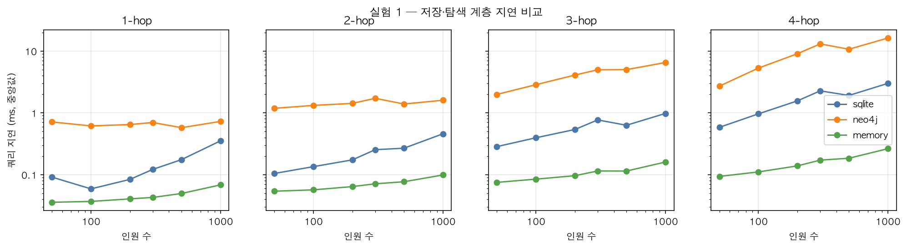
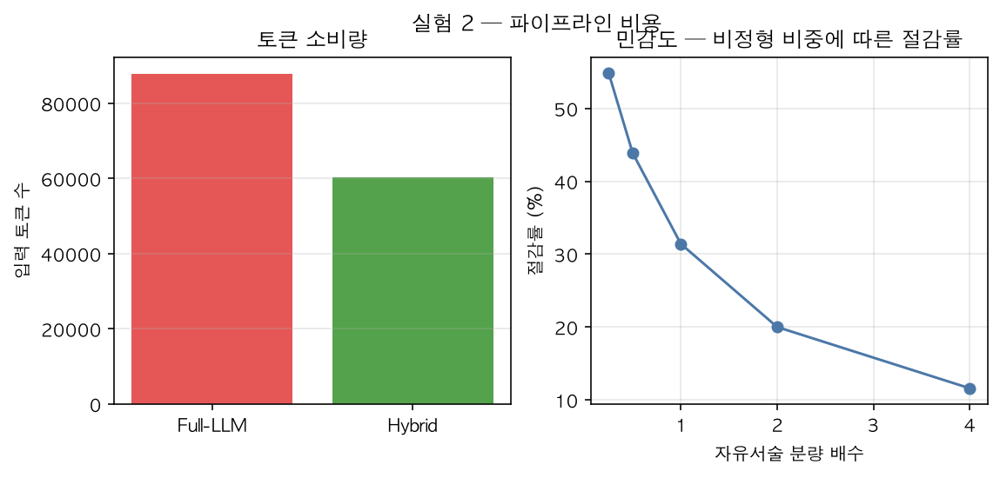
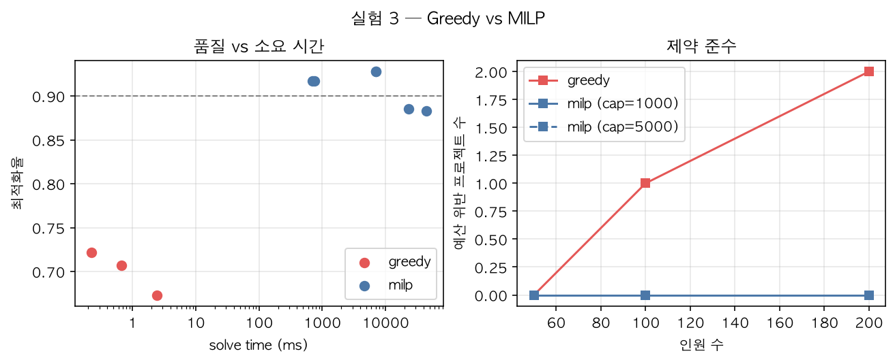

# TeamWeaver 최적화 실험 리포트

> 이 파일은 `experiments/report.py`가 `experiments/results/*.json`에서 생성한다. **직접 수정하지 말 것** — 실험을 다시 돌린 뒤 `uv run python -m experiments.report`로 갱신하면 동일 입력에 대해 **재현 가능**한 동일 결과가 나온다.

## 측정 방법론

- 실험 1은 반복 20회, 백엔드별 웜업은 memory 웜업 3회, neo4j 웜업 50회, sqlite 웜업 3회 (neo4j는 드라이버/서버 예열을 위해 더 큰 웜업을 쓴다), **중앙값과 p95**를 보고한다
- 실험 3(알고리즘)은 solver 특성상 반복 없이 1회 solve 시간을 그대로 보고한다
- 데이터 생성 시드 고정(seed=42) — `fixtures/meta.json`과 실험 3 결과가 같은 시드를 기록해 세 실험 공통임을 교차 확인했다. 동일 시드로 재실행하면 동일 데이터가 생성된다
- 실험 코드는 제품 코어(`core/`)를 그대로 import한다. **벤치마크 수치 = 실제 제품 성능**
- 결과가 가설과 다르면 결과를 조작하지 않고 논지를 결과에 맞춰 서술한다

**실행 환경:** Python 3.12.13 · macOS-26.5.2-arm64-arm-64bit · CPU 10코어(Apple M4) · RAM 16.0 GiB · Neo4j 서버 Neo4j Kernel 5.26.28 (community)

---

## 실험 1 — 저장·탐색 계층 3자 비교

**질문:** 인력 집합의 N-hop 협업 문맥을 수집·집계할 때 어느 저장 방식이 빠른가?

**측정 범위(50~1000명, hops 1~4) 전 구간에서 memory < sqlite < neo4j 순서가 유지된다 — "규모·hops가 커지면 Neo4j가 역전한다"는 이 실험의 원 가설은 기각된다.**

| 인원 | hops | sqlite | neo4j | memory | 결과수 |
|---:|---:|---:|---:|---:|---:|
| 50 | 1 | 0.043 | 1.504 | 0.039 | 17 |
| 50 | 2 | 0.105 | 1.183 | 0.054 | 66 |
| 50 | 3 | 0.281 | 2.182 | 0.074 | 157 |
| 50 | 4 | 0.597 | 3.787 | 0.093 | 221 |
| 100 | 1 | 0.058 | 0.808 | 0.036 | 19 |
| 100 | 2 | 0.141 | 1.421 | 0.059 | 83 |
| 100 | 3 | 0.398 | 2.863 | 0.084 | 239 |
| 100 | 4 | 0.971 | 4.737 | 0.110 | 414 |
| 200 | 1 | 0.088 | 0.689 | 0.040 | 17 |
| 200 | 2 | 0.177 | 1.849 | 0.062 | 91 |
| 200 | 3 | 0.535 | 3.756 | 0.095 | 333 |
| 200 | 4 | 1.544 | 8.718 | 0.142 | 744 |
| 300 | 1 | 0.218 | 0.695 | 0.096 | 26 |
| 300 | 2 | 0.255 | 1.708 | 0.071 | 130 |
| 300 | 3 | 0.774 | 5.206 | 0.114 | 459 |
| 300 | 4 | 2.254 | 12.091 | 0.174 | 1038 |
| 500 | 1 | 0.172 | 0.570 | 0.048 | 16 |
| 500 | 2 | 0.269 | 1.461 | 0.077 | 94 |
| 500 | 3 | 0.633 | 3.895 | 0.118 | 330 |
| 500 | 4 | 1.963 | 10.962 | 0.191 | 990 |
| 1000 | 1 | 0.350 | 0.644 | 0.064 | 25 |
| 1000 | 2 | 0.468 | 1.688 | 0.103 | 113 |
| 1000 | 3 | 0.986 | 5.537 | 0.162 | 457 |
| 1000 | 4 | 2.978 | 16.992 | 0.268 | 1532 |

*단위: ms, 반복 20회 중앙값. 연결 수립·적재 시간 제외.*

> ✅ 백엔드 결과 일치 24건 전부 확인 — 세 방식이 같은 도달 집합을 반환한다.

**프로토콜 바닥값(protocol_floor):** 중앙값 0.6058ms / p95 1.0627ms — 실제 그래프 순회 없이 요청·응답만 왕복하는 최소 IPC 비용의 실측치다.

**p95 요약 (hop별, 인원 50~1000명 범위의 최소~최대):**

| hops | sqlite p95(ms) | neo4j p95(ms) | memory p95(ms) |
|---:|---:|---:|---:|
| 1 | 0.044~0.359 | 0.644~3.828 | 0.042~0.135 |
| 2 | 0.108~0.481 | 1.431~2.983 | 0.059~0.114 |
| 3 | 0.288~1.031 | 2.689~7.665 | 0.078~0.167 |
| 4 | 0.626~3.000 | 5.867~17.647 | 0.095~0.273 |

> 인원 수가 늘어난다고 순회 결과 수(result_count)가 항상 함께 늘지는 않는다 — hops=1: n=100→200에서 결과수 19→17; hops=1: n=300→500에서 결과수 26→16; hops=2: n=300→500에서 결과수 130→94; hops=3: n=300→500에서 결과수 459→330; hops=4: n=300→500에서 결과수 1038→990. 인원 수를 작업량의 단조 대리지표로 쓰지 말 것(결과 수가 적으면 순회할 것도 적어 그만큼 더 빠르다).

### 스코프 명시 (반드시 함께 읽을 것)

1. **hops=1 비교는 순회가 아니라 IPC가 지배한다.** hops=1 neo4j 시간은 순수 왕복 비용(protocol_floor, 중앙값 0.606ms)과 측정 오차 안에서 구별되지 않는다 — 바닥값이 쿼리 시간의 40~106%에 해당해 일부 구간에서는 바닥값이 쿼리 시간을 넘어서기까지 한다. 즉 이 구간에서 잰 것은 그래프 순회 비용이 아니라 프로토콜 왕복 비용이므로, 얕은 hop만 보고 백엔드를 비교하면 오해를 부른다.
2. **인메모리 백엔드의 승리는 거의 동어반복적(near-tautological)이다.** 이 측정은 빌드/적재 비용을 제외했고, 인메모리 구조는 이미 전량 RAM에 상주하며 이번 워크로드는 어차피 RAM에 다 들어간다 — "발견"이 아니라 설계상 당연한 결과다.
3. **이 실험은 제안된 하이브리드("Neo4j 저장·탐색 + 인메모리 연산")가 아니라 세 개의 독립 대안을 각각 측정한 것이다.** 하이브리드의 실제 가치(영속성, 임의 탐색, Graph RAG 서브그래프 검색)는 이 벤치마크가 다루지 않는다.
4. **측정 구간 자체가 백엔드 간 비대칭이다.** 인메모리 방식은 `node_polarity`를 그래프 빌드 시점에 미리 계산해 두고(빌드는 측정 밖) 순회 시점에는 조회만 한다(`core/graph/memory_graph.py:56-58`). 반면 SQLite는 매 호출마다 `node_polarity` CTE를 다시 계산하고, Neo4j는 매 호출마다 `avg(v.polarity)`를 다시 집계한다 — 즉 측정된 인메모리 시간에는 이 집계 비용이 아예 들어있지 않다. 스코프 노트 2(적재 비용 제외)와는 별개의 비대칭이다.

> neo4j/sqlite 배율은 hops=4 기준 4.88~6.34배 범위에서 평평하다 — 규모가 커진다고 격차가 좁혀지는 추세는 관측되지 않았다.

---

## 실험 2 — 파이프라인 비용 (Full-LLM vs Hybrid)

**모델:** `gpt-5-nano` · **단가 기준일:** 2026-08-05 · **리뷰 266건**

| 방식 | 입력 토큰 | 추정 비용(USD) |
|---|---:|---:|
| Full-LLM (정형+항목+서술 전부) | 87,896 | 0.2075 |
| Hybrid (자유서술만) | 60,292 | 0.1423 |

**측정된 절감률: 31.4%**

> 이 절감률은 대수적으로 입력 토큰 비율(1 − hybrid/full)과 같다 — 출력 토큰 가정(out_ratio)이 두 arm에 같은 배수로 적용되는 한 그 배수는 cost 비율에서 상쇄되어 결과에 전혀 영향을 주지 않는다(`tests/test_exp2.py::test_savings_pct_is_independent_of_out_ratio`가 회귀 테스트로 고정). 즉 아래 달러 금액은 출력 토큰 가정에 따라 크게 바뀌지만, 이 절감률 자체는 그 가정과 무관하다 — 달러는 노출을 더할 뿐 절감률에 대한 추가 정보를 주지 않는다.

> 절감률은 목표치가 아니라 **측정 결과**다. 우리 fixture의 정형:비정형 비중이 이 값을 결정하므로 아래 민감도 곡선을 함께 본다.

> 프로젝트 초기 설계 문서는 이보다 **훨씬 높은** 절감률을 목표로 제시했다 — 위 측정치는 그 목표에 크게 못 미친다. 최초 목표 수치 자체는 `experiments/results/*.json` 범위 밖의 로컬 설계 문서에만 있어 이 리포트에는 싣지 않는다(원 목표는 `.omc/plan/2026-08-02-teamweaver-poc-design.md` 참조 — 이 경로는 `.gitignore`의 `.omc/` 규칙 대상이라 이 저장소를 클론한 사람은 파일을 열어볼 수 없다; 그래서 정확한 수치를 싣는 대신 존재와 위치만 밝힌다).

*출력 토큰/입력 토큰 비율 가정: 5.777 — 근거: Task 6 체크포인트 실측 gpt-5-nano(parse_model) completion/prompt = 429,783/74,390 (266건 전량, experiments/results/llm_checkpoint_summary.json — hybrid-shaped parse 워크로드에서 측정, Full-LLM 페이로드로의 적용은 다른 형태 간 외삽임)*

**출력 토큰 모델 민감도** — savings_pct가 출력 토큰을 어떻게 가정하느냐에 얼마나 의존하는지 정반대 가정 두 가지로 계산했다:

| 출력 토큰 가정 | 절감률(%) |
|---|---:|
| 출력 ∝ 입력 (이 실험이 채택) | 31.41 |
| 출력 두 arm 동일(실측 completion 토큰 고정) | 0.78 |

> 출력 토큰 가정을 '입력에 비례'에서 '두 arm 동일'로 바꾸면 절감률은 31.4%→0.8%로 바뀐다 — 이 실험이 실제로 채택한 가정(출력 ∝ 입력)이 헤드라인 절감률을 얼마나 떠받치고 있는지를 보여준다. 게다가 5.777이라는 비율 자체는 이 실험의 페이로드가 아니라 hybrid-shaped parse 워크로드(자유서술만 담은 기존 파싱 프롬프트)에서 측정된 것이므로, 위 표의 '이 실험이 채택' 행은 서로 다른 페이로드 형태 간 외삽에 기댄 결과라는 점을 함께 읽을 것 — 특히 그 비율이 큰 이유 자체가 추론 모델의 내부 추론 토큰(과제 난이도에 비례, 프롬프트 길이에 비례하지 않음)이라서 고정 출력 스키마를 갖는 이 추출 과제에 '출력 ∝ 입력' 가정을 적용하는 것은 특히 취약하다.

| 자유서술 분량 배수 | 절감률(%) |
|---:|---:|
| 0.25× | 54.9 |
| 0.5× | 43.9 |
| 1.0× | 31.4 |
| 2.0× | 20.0 |
| 4.0× | 11.6 |

> 자유서술 분량이 0.25×~4.0×일 때 절감률은 54.9%→11.6%로 단조 감소한다 — 절감률은 고정 상수가 아니라 정형/비정형 리뷰 내용 비중에 강하게 의존하는 값이다.

**정확도 검증:** live=False 이므로 미측정

**지연(latency) 검증:** 미측정 — 이번 실험은 라이브 타이밍 호출을 하지 않았다(비용 절감을 위해 오프라인 토큰 카운팅만 수행). 아래는 Task 6에서 실측된 파싱 워크로드 지연을 참고치로 인용한 것이며, 이번 실험의 Full-LLM/Hybrid 페이로드 형태로 직접 측정된 값이 아니다.

> 참고치 근거: Task 6 체크포인트 실행(gpt-5-mini gen + gpt-5-nano parse, 266건 리뷰 = 532회 API 호출): 리뷰당(gen+parse 2회 합산) 관측 지연 ~24-28초, foreground 배치 실행 1회당 5.1-8.5분(회당 3~18건, 20회 실행). 개별 API 호출 단위로는 ~10-28초로 추정(추론 모델 특성상 completion에 내부 추론 토큰이 실려 지연이 커짐 — MEASURED_OUT_RATIO가 큰 것과 동일한 원인).

> 주의: 이 지연은 parse_reviews_llm의 기존 프롬프트(좋은점/나쁜점 서술만 전달)로 측정된 것이다. 이번 실험의 Full-LLM 페이로드는 정형 이력+항목선택+서술 전부를 담아 입력 토큰이 더 크므로 지연이 이보다 클 것으로 추정되나 직접 측정되지 않았다 — Full-LLM 페이로드 형태의 실측이 아니라 parse 워크로드 실측을 그대로 인용한 하한(lower-bound) 성격의 참고치다.

> 출처: `experiments/results/llm_checkpoint_summary.json`

> 이 비교의 전제는 fixture가 실제 LLM 호출로 생성된 리뷰(266건, `review_mode=llm`, 생성 모델 `gpt-5-mini`, 파싱 모델 `gpt-5-nano`(`fixtures/meta.json` 기록))라는 것이다 — 템플릿 생성 리뷰였다면 자유서술의 극성(polarity)이 정형 `item_score`의 결정론적 함수였으므로 비정형 항목이 별도 정보를 담지 않아, 정형 대 비정형을 비교하는 이 실험의 전제 자체가 성립하지 않았다. (정확한 재동결 비용은 results/*.json 범위 밖이라 이 리포트에는 싣지 않는다 — Task 6 작업 기록 참조.)

---

## 실험 3 — 알고리즘 (Greedy vs MILP)

> **데이터 출처:** 이 스윕의 모든 행은 datasets.build_scale()이 규모마다 새로 생성한 데이터셋을 쓴다 (core.datagen.generator, seed=42 고정, rule-based 파싱의 템플릿 리뷰) — 커밋된 LLM 모드 데모 fixture(fixtures/*.json)를 로드하지 않는다. n=100 지점도 인원·프로젝트 수만 fixture와 같을 뿐 리뷰 텍스트가 달라 C 행렬과 optimization_ratio가 fixture와 다르다 — 프로젝트 개수/인원 수가 같다고 같은 데이터가 아니다.

| 알고리즘 | 인원 | pair_cap | solve(ms) | 최적화율 | 미충원 |
|---|---:|---:|---:|---:|---:|
| greedy | 50 | — | 0.2 | 0.722 | 1 |
| milp | 50 | 1000 | 751.4 | 0.917 | 0 |
| milp | 50 | 5000 | 705.7 | 0.917 | 0 |
| greedy | 100 | — | 0.7 | 0.707 | 0 |
| milp | 100 | 1000 | 7090.2 | 0.928 | 0 |
| milp | 100 | 5000 | 6994.3 | 0.928 | 0 |
| greedy | 200 | — | 2.4 | 0.673 | 3 |
| milp | 200 | 1000 | 23321.1 | 0.885 | 0 |
| milp | 200 | 5000 | 44700.1 | 0.883 | 0 |

### 제약 준수 — 이 실험의 핵심

| 알고리즘 | 인원 | pair_cap | 예산 위반 프로젝트 수 |
|---|---:|---:|---:|
| greedy | 50 | — | 0 |
| milp | 50 | 1000 | 0 |
| milp | 50 | 5000 | 0 |
| greedy | 100 | — | 1 |
| milp | 100 | 1000 | 0 |
| milp | 100 | 5000 | 0 |
| greedy | 200 | — | 2 |
| milp | 200 | 1000 | 0 |
| milp | 200 | 5000 | 0 |

> Greedy는 점수만 보고 담아 예산을 넘긴 해를 내놓는다. MILP는 예산을 지키는 대신 부족분을 미충원으로 **정직하게 드러낸다** — 실행 가능한 해와 그렇지 않은 해의 차이다.

> Greedy는 구조적으로 예산 로직이 없다 — 각 프로젝트에 필요한 인력을 점수순으로 다 배정한 *뒤에야* 그 프로젝트의 누적 비용을 예산과 비교해 위반 여부만 *기록*할 뿐, 그 결과로 어떤 후보도 거부하거나 배정을 되돌리지 않는다(`core/optimize/greedy.py`, `for j, proj in ...` 루프 안에서 해당 프로젝트의 배정이 끝난 뒤 `if cost > proj.monthly_budget`을 확인). 따라서 아래 "MILP 0건 vs Greedy 0→1→2건"은 예산 제약을 아예 갖지 않는 베이스라인이 치르는 구조적 대가를 재는 것이지, **저비용의 제약-인지 휴리스틱이 존재하지 않는다는 근거가 아니다.**

> MILP는 측정된 모든 규모(50, 100, 200명)·모든 pair_cap(1000, 5000)에서 예산 위반 0건이다.

> Greedy의 예산 위반(원시 건수/프로젝트 수 대비 비율): n=50: 0/10건(0%), n=100: 1/20건(5%), n=200: 2/40건(5%).

> MILP(pair_cap=1000)의 optimization_ratio는 n=50: 0.9169, n=100: 0.9278, n=200: 0.8855이다.
> **n=200에서 90% 목표선 아래로 떨어진다** — "목표 90%"는 이 스윕이 기준으로 삼은 n=100(seed=42로 새로 생성한 데이터셋 — 커밋된 데모 fixture가 아니다)에서만 성립하고, 규모가 커지면 유지된다는 보장이 없다.
> 참고로 커밋된 데모 fixture(LLM 모드 리뷰, `README.md`의 E2E 스모크 기록 참고)는 n=100에서 optimization_ratio=0.9300를 낸다 — 이 스윕의 n=100 값(0.9278)과는 다른 수치다. 인원·프로젝트 수는 fixture와 같지만 리뷰 텍스트가 다르게 생성되어 C 행렬(시너지)이 달라지기 때문이다 — 두 수치를 같은 것으로 섞어 인용하지 말 것.

> **optimization_ratio가 재는 것:** 분자·분모 모두 스킬 항(Σ S_ij·a_ij)만 쓴다(`core/optimize/metrics.py::optimization_ratio`) — 하지만 배치 자체는 `solve_milp`가 스킬 + λ·시너지 − μ·클리크 패널티 − slack 패널티라는 다중 항 목적함수를 최대화해 고른 것이다. 즉 이 비율은 그 다중 항 목적함수 중 스킬 항 하나만 측정한다. 실제 solve 파라미터: λ=0.3, μ=0.2, gap=0.05, time_limit=180s, pair_keep_ratio=0.15, min_alloc=0.2, slack_penalty=100.0(max_pairs는 cap별로 다름, 위 표 참고).

### pair_cap 절삭 수준 비교

| 인원 | 최적화율(cap=1000) | 최적화율(cap=5000) | solve(ms, cap=1000) | solve(ms, cap=5000) | 시간 배율 |
|---:|---:|---:|---:|---:|---:|
| 50 | 0.9169 | 0.9169 | 751.4 | 705.7 | 0.94× |
| 100 | 0.9278 | 0.9278 | 7090.2 | 6994.3 | 0.99× |
| 200 | 0.8855 | 0.8829 | 23321.1 | 44700.1 | 1.92× |

> 최적화율 차이는 최대 0.0026으로 사실상 잡음 수준이다. 반면 시간 배율은 0.94×~1.92× 범위다 — cap을 올리는 것이 품질 이득 없이 시간만 태우는 규모가 있다.

### 대안(Plan B/C/D) 품질

| 인원 | 대안 수 | 라벨 | Plan A 대비 품질 | Plan A와 Jaccard |
|---:|---:|---|---|---|
| 50 | 3 | A/B/C/D | 0.998, 0.997, 0.996 | 0.646, 0.646, 0.683 |
| 100 | 3 | A/B/C/D | 0.995, 0.990, 0.987 | 0.689, 0.695, 0.674 |
| 200 | 3 | A/B/C/D | 0.997, 0.992, 0.996 | 0.686, 0.701, 0.669 |

> 이 표의 Plan A는 gap=0.01로, 대안(B/C/D)은 gap=0.05로 solve된다(둘 다 max_pairs=5000 고정 — `core/optimize/alternatives.py::generate_plans`) — 위쪽의 "pair_cap 절삭 수준 비교" 표(gap=0.05, cap∈{1000, 5000})와는 gap·cap 조합이 달라 직접 비교할 수 없다. Plan A 자체도 그 표의 어느 행과도 같은 조건으로 solve된 것이 아니다.

### 미측정 규모 (n≥300)

| 인원 | 프로젝트 | 상태 | 사유 |
|---:|---:|---|---|
| 300 | 60 | skipped | extrapolated beyond practical session budget: milp cap=1000 solve_ms 766.7 -> 6933.5 -> 22628.7 at n=50/100/200 (9.04x, then 3.26x per doubling); n=300 was attempted twice and killed (CBC healthy, not hung, but not converging inside budget) before this skip list was added |
| 500 | 100 | skipped | extrapolated beyond practical session budget: milp cap=1000 solve_ms 766.7 -> 6933.5 -> 22628.7 at n=50/100/200 (9.04x, then 3.26x per doubling); n=300 was attempted twice and killed (CBC healthy, not hung, but not converging inside budget) before this skip list was added |
| 1000 | 200 | skipped | extrapolated beyond practical session budget: milp cap=1000 solve_ms 766.7 -> 6933.5 -> 22628.7 at n=50/100/200 (9.04x, then 3.26x per doubling); n=300 was attempted twice and killed (CBC healthy, not hung, but not converging inside budget) before this skip list was added |

> 위 규모는 **미측정(skipped)** 이다 — 아래 표의 solve time·optimization_ratio 수치는 이 규모들을 다루지 않는다. 인용 시 "n≥300은 외삽 근거로 제외했다"는 사실을 함께 밝힐 것.

---

## 한계 (반드시 함께 읽을 것)

- **단일 시드 기준**: 규모별 수치는 시드 하나에 대한 한 번의 관측이다. 분산은 측정하지 않았다.
- **로컬 단일 머신**: 네트워크·디스크 조건이 다른 운영 환경의 수치를 보장하지 않는다.
- **실험 1의 hops=1 잔존 노이즈**: protocol_floor는 프로토콜 왕복 비용의 실측 하한이지만, 재시작 직후 JVM/드라이버 웜업의 잔여 편차가 hops=1 절대값에 남아 있을 수 있다 — 얕은 hop 비교는 참고용으로만 쓸 것.
- **CBC(오픈소스 솔버) 기준**: 상용 솔버(Gurobi 등)를 쓰면 solve time이 크게 달라진다.
- **실험 3의 n≥300 미측정**: n=50/100/200의 solve time 증가율을 외삽한 결과 세션 예산을 넘어서 스킵했다 — 대규모 구간에서 MILP가 실용적인지는 이 실험만으로는 답할 수 없다 (자세한 사유는 위 "미측정 규모" 표).
- **시너지 쌍 절삭**: 규모 스윕에서는 |C| 상위 쌍만 시너지 항에 포함했다. 절삭 수준(pair_cap)별 영향은 실험 3 표에 함께 실었다.
- **실험 2의 정확도 축 미측정**: Full-LLM 재추출 항목과 원본 체크박스의 일치율은 실호출로 검증하지 않았다(live=False).
- **실험 2의 지연(latency) 축 미측정**: 이번 실행은 오프라인 토큰 카운팅만 수행했다. Task 6 체크포인트 실측치를 참고로 인용했으나, 다른 프롬프트 형태로 측정된 하한 성격의 수치이지 이번 페이로드로 직접 측정된 값이 아니다.
- **실험 2의 절감률은 출력 토큰 가정에 대해 검증되지 않았다**: savings_pct는 출력 토큰 가정(out_ratio) 자체에는 불변이지만, 그 가정 형태(출력 ∝ 입력 vs 출력 고정)를 바꾸면 크게 달라진다(위 "출력 토큰 모델 민감도" 표) — 이 실험의 5.777 비율은 다른 형태의 페이로드에서 측정한 외삽치다.
- **실험 3의 스윕은 커밋된 데모 fixture를 로드하지 않는다**: 규모마다 seed=42로 새로 생성한 데이터셋(템플릿 리뷰)을 쓴다 — n=100 지점도 fixture와 인원·프로젝트 수만 같을 뿐 리뷰 텍스트가 달라 optimization_ratio가 다르다(위 실험 3 절 참고).

## 결론

위 세 실험의 수치가 아키텍처 선택의 근거다. 각 실험의 표와 그림을 그대로 인용하되, **한계 섹션을 함께 제시할 것** — 조건을 밝히지 않은 수치는 심사에서 방어할 수 없다.
